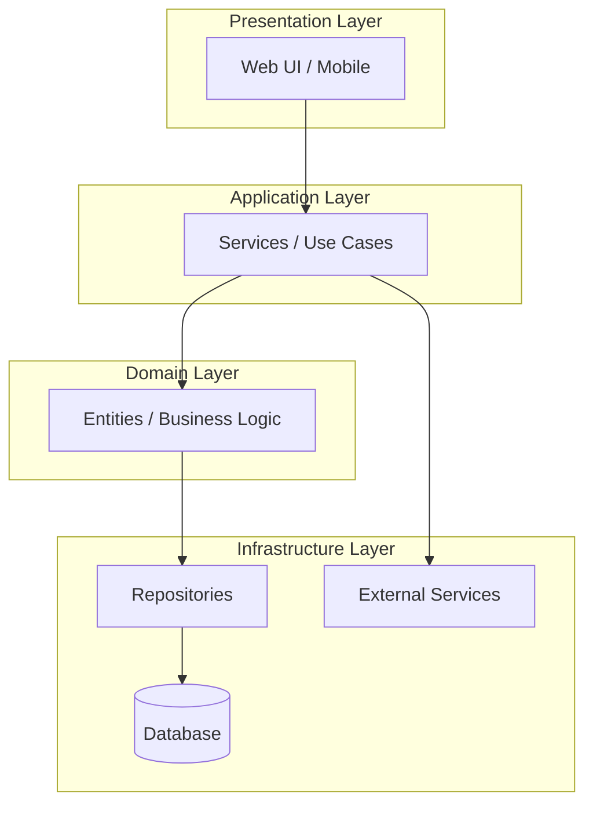

# Architecture Patterns Reference

## Decision Framework

For each architectural style, evaluate against:
- **Functional fit** — does the style support the required use cases naturally?
- **Non-functional fit** — performance, scalability, availability, security
- **Team & operational fit** — team structure, deployment complexity, observability
- **Evolution fit** — expected change patterns over the system lifetime

## Architectural Styles

### 1. Layered (N-Tier)

**When to use:**
- Simple CRUD applications
- Well-understood domain with stable requirements
- Small-to-medium team

**Diagram template (Mermaid):**


### 2. Hexagonal (Ports & Adapters)

**When to use:**
- Domain logic must be testable in isolation
- Multiple input/output channels expected
- Domain complexity is the primary challenge

### 3. Microservices

**When to use:**
- Independent deployability required
- Teams organized around business capabilities
- Different scaling requirements per component
- Polyglot persistence needed

### 4. Event-Driven

**When to use:**
- Loose coupling between producers and consumers
- Asynchronous workflows dominate
- Real-time data propagation needed
- Event sourcing or CQRS under consideration

### 5. CQRS (Command Query Responsibility Segregation)

**When to use:**
- Read and write workloads are significantly different
- Complex query requirements that span aggregates
- Event sourcing is already in use
- Separate scaling for reads and writes needed

## Architecture Decision Record (ADR) Template

```markdown
### ADR-{NNN}: {Title}

**Status:** Proposed | Accepted | Deprecated | Superseded

**Context:**
What is the issue we're addressing?

**Decision:**
What did we decide?

**Consequences:**
What becomes easier? What becomes harder?

**Alternatives Considered:**
- Alternative A — rejected because ...
- Alternative B — rejected because ...
```
