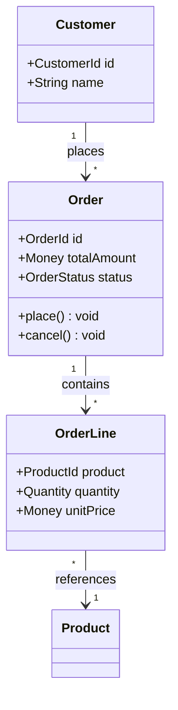
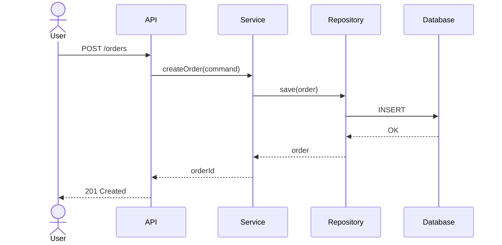
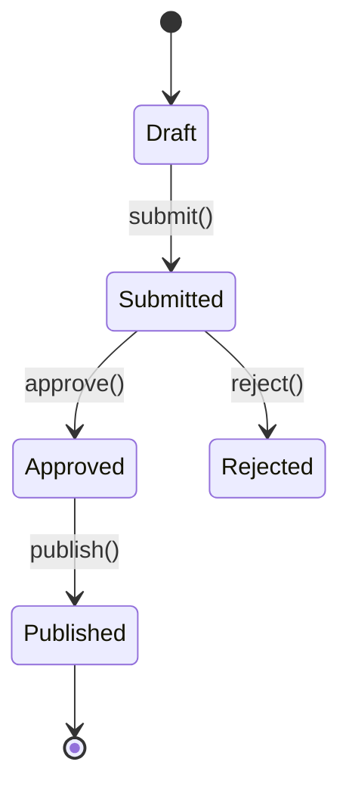
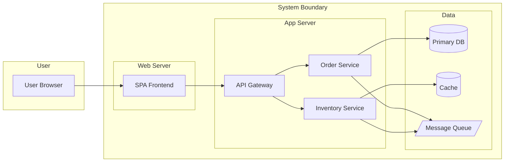

# UML Modeling with Mermaid

## Conventions

- Use `classDiagram` for structural models (domain model, class design)
- Use `sequenceDiagram` for behavioral models (API flows, component interactions)
- Use `stateDiagram-v2` for lifecycle models
- Use `flowchart` for process flows and C4 container diagrams
- Use `erDiagram` for data models (see api-design skill instead for ER specifics)

## Class Diagram

**Conventions:**
- Use `+` for public, `-` for private
- Use domain names (not database column names) for attributes
- Relationships: `-->` association, `--|>` inheritance, `..>` dependency, `*--` composition, `o--` aggregation

## Sequence Diagram

## State Diagram

## C4 Container Diagram (via flowchart)

