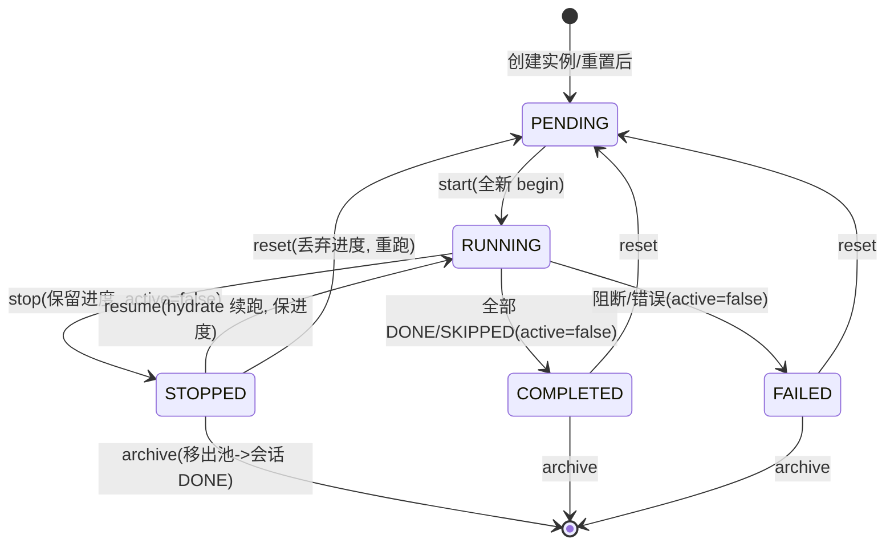

# Workflow 实例生命周期设计（绑定 / 状态机 / 归档 / 完整性）

> 本文是"流程控制完整化"（development-plan.md Iter-16）的技术方案。它把 Iter-15 只打通
> 的"面板 → 路由 → 写状态 + 注消息"升级为可闭环的实例生命周期管理。
>
> **核心设计原则**：
> 1. 权威在 workflow 实例侧（绑定真相 / 运行态 / 归档态都落在实例）。
> 2. Session 状态一律**派生**，不侵入 DSH Session（插件只读、不写 session）。
> 3. 判断标准是 **`.workflow-agent` 整树完整性**，不依赖任何独立"绑定指针"文件记录。
> 4. 状态基于文件：删除记录后重读文件即重新派生，无内存态不一致；运行中损坏会报错，
>    重启 DSH / 刷新浏览器触发内存重载，按简单处理。

---

## 1. 数据模型

```
<workspace>/.workflow-agent/
├─ instances/<instanceId>/             # 实例池（活跃：可绑、可跑）
│     ├─ metadata.json   # 绑定真相 {instanceId, workflowName, sessionId, sessionCwd, ...}
│     ├─ instance.yaml   # 实例定义快照（源 YAML + 参数注释头）
│     ├─ state.json      # 运行态快照（engine snapshot；stage/tasks/runnable/...）
│     ├─ output/         # 每实例产物
│     └─ logs/           # 每实例日志
└─ archive/<instanceId>/<ts>_<kind>_<state>/   # 归档库（移出池，只读）
      ├─ manifest.json   # {kind, state, reason, archivedAt, workflowName, ...}
      ├─ instance.yaml  state.json  output/  logs/  metadata.json
```

| 概念 | 含义 | 归属 |
|------|------|------|
| **workspace** | 共享存储单元，实例池根。会话创建时显式指定（DSH 里即该会话 `cwd`）；同 workspace 的会话共享实例池。workspace:Session = **1:N**。 | 文件系统 |
| **Session** | 执行单元。创建时绑一个 workspace，**1:1 永久绑定**一个实例。状态（UNBOUND/BOUND/DONE/BROKEN）**派生**自实例 + 工作区完整性。 | DSH（只读）|
| **实例** | 权威状态载体：`metadata.json.sessionId`（绑定）、`state.json`（运行态）、归档 metadata（归档态）。 | 插件（实例）|
| **归档** | 已完成/已停止实例的副本，**移出池**，带 `kind`(reset/archive) + `state` 命名。 | 插件（归档）|

---

## 2. 工作区骨架与完整性（纯完整性判定）

### 2.1 骨架物化
当 workspace 首次挂接 workflow 会话时，插件**立刻物化**标准骨架（不依赖某个实例存在）：

```
<workspace>/.workflow-agent/
├─ instances/   # 0..N 个实例目录
└─ archive/     # 0..N 个归档
```

"骨架在场 + 结构自洽"本身是一个可靠、可检查的完整性信号；骨架缺失/退化即为异常。

### 2.2 判定标准：整树完整性（而非文件记录）
**不设独立"绑定指针"文件**——因为指针也是可被一起删除的记录，把它当判断依据最脆弱。
判断标准是 `.workflow-agent` 整棵树：

- 骨架在场且自洽 → 按导出状态判（BOUND/DONE/UNBOUND）。
- 骨架缺场 / 退化 / 冲突（无法唯一导出状态）→ **BROKEN**（需新建会话，不静默重建）。

### 2.3 操作语义（沿用文件即状态）
- 正常：读文件拿状态；内存只作为缓存，每次加载从文件重新派生。
- 删记录后重新读：重读文件即重新派生，**无内存态不一致**。
- 运行中删除：运行时读文件报错 → 处理为 BUSY/BROKEN；**重启 DSH 或刷新浏览器**会触发
  内存态重载，从文件重派生，按简单处理。
- 因此无需复杂的内存↔磁盘一致性协议。

---

## 3. 会话绑定状态机（派生）

Session 的状态**不定存**在 session 上，而是按当前 sessionId 实时从"实例 + 工作区完整性"推导。

| 派生状态 | 判定依据 |
|---------|---------|
| **UNBOUND** | 骨架在场且自洽；无任何实例声明 S，也无任何归档声明 S（可新建/采用）。 |
| **BOUND** | `instances/` 里恰好一个**结构完好**的实例目录，其 `metadata.json.sessionId === S`。 |
| **DONE** | 无 BOUND；`archive/` 中存在 `metadata.sessionId === S` 的归档记录（会话终态，不再执行工作流）。 |
| **BROKEN** | 完整性被破坏、无法唯一导出：① 骨架缺场；② 声明绑 S 的实例目录结构损坏；③ 多个实例同时声明 S（违反 1:1）；④ 退化不可判定。 |

```
UNBOUND ──create-bind/adopt──▶ BOUND ──archive-instance──▶ DONE(终态)
                                  │
                           实例目录缺失/损坏/冲突(detected)
                                  ▼
                               BROKEN ──(新建全新 workflow 会话)──▶ 全新 UNBOUND
```

### 3.1 绑定转移（BOUND/UNBOUND/DONE）
| 转移 | 前置条件 | 副作用 |
|------|---------|--------|
| `create-bind`：UNBOUND→BOUND | 会话未绑定 | 新建实例并写 `metadata.sessionId=S` |
| `adopt`：UNBOUND→BOUND | 目标实例 `metadata.sessionId == null`（未被占用） | 写 `metadata.sessionId=S` |
| `archive-instance`：BOUND→DONE | 绑定实例处于 STOPPED/COMPLETED/FAILED（RUNNING 先 stop） | 实例移出池进归档；会话终态 |
| `delete-session`：任意→终态 | — | 若 BOUND 且 RUNNING 先强制置 STOP；解绑 `metadata.sessionId=null` 回 UNBOUND 池；会话消失 |

**1:1 守卫**：一个会话只能绑一个实例；一个实例只能被一个会话占用；绑定后禁再绑/切换（删除会话除外）。

---

## 4. 运行状态机（实例级）

状态：`PENDING | RUNNING | STOPPED | COMPLETED | FAILED`

```
   PENDING ──start──▶ RUNNING ──(全部 DONE/SKIPPED)──▶ COMPLETED
      │                 │  ├stop──▶ STOPPED
  (无 reset/archive/stop)│  │        │
      │                 │  │        ├─ resume ─▶ RUNNING（续跑，保进度）
      │                 │  │        ├─ reset  ─▶ PENDING（丢弃进度，重跑）
      │                 │  │        └─ archive ─▶（移出池）
      │                 │  ├───────▶ FAILED（阻断/错误）
      │                 │  └─ archive（须先 stop）
      └─────────────  reset 目标：STOPPED/COMPLETED/FAILED ─▶ PENDING
```

### 4.1 转移表
| 当前 | 动作 | 下一 | 语义/副作用 |
|------|------|------|------------|
| PENDING | `start` | RUNNING | 全新 begin（读 instance.yaml、清任务、active=true、写 state.json、驱动指令） |
| PENDING | ~~reset~~ | — | **不支持**（无执行内容，无意义） |
| PENDING | ~~archive~~ | — | **不支持**（无内容且浪费空间） |
| RUNNING | `stop` | STOPPED | **保留已完成任务进度**，active=false，编排 Agent 停 |
| RUNNING | ~~reset~~ | — | **须先 stop**（优雅释放资源） |
| RUNNING | ~~archive~~ | — | **须先 stop** |
| RUNNING | (内置) | COMPLETED | 全部 DONE/SKIPPED，active=false |
| RUNNING | (内置) | FAILED | 阻断/错误，active=false |
| STOPPED | `resume` | RUNNING | **hydrate 已存 state.json（续跑，保住 DONE）**，active=true |
| STOPPED | `reset` | PENDING | 丢弃进度，重跑（先确认 + reset 归档备份） |
| STOPPED | `archive` | （移出池） | 有执行内容，可归档 → 会话 BOUND→DONE |
| COMPLETED | `reset` | PENDING | 重跑 |
| COMPLETED | `archive` | （移出池） | 可归档 |
| FAILED | `reset` | PENDING | 重跑 |
| FAILED | `archive` | （移出池） | 可归档 |

**拒绝对话**：`resume` 仅 STOPPED；`start` 仅 PENDING；`stop` 仅 RUNNING；`reset`/`archive` 仅
STOPPED/COMPLETED/FAILED（PENDING 全不支持，RUNNING 须先 stop）。`setStage('STOPPED')` 需将
`active` 置 false；STAGE 枚举应补 STOPPED。

---

## 5. 流程控制动作与驱动指令

面板控制走 Host 路由 → 操作实例状态 → 编排 Agent 通过轮询/工具发现状态变化后继续。

- 每个控制动作都携带结构化信息，替代 Iter-15 的自由文本注入：
  - `start`：`{action:'start', instanceId, workspaceRoot}` → 引擎全新 begin，驱动编排 Agent 对
    **该 instanceId** 跑（而非 workflow_begin 新建实例）。
  - `stop`：`{action:'stop', instanceId}` → 置 STOPPED。
  - `resume`：`{action:'resume', instanceId}` → hydrate state.json（续跑），重驱动。
  - `reset`：`{action:'reset', instanceId}` → 确认 + reset 归档备份 + 全新 begin。
  - `archive`：`{action:'archive', instanceId}` → 移出池进归档，会话→DONE。
- 编排 Agent 的 system-prompt 需在每步前检查 `stage`（STOPPED 即停），并对指定 `instanceId`
  用 `workflow_start/status/reset` 等工具，而非 `workflow_begin` 新建实例。

---

## 6. 重置（确认 + 备份）

重置 = COMPLETED/STOPPED/FAILED → PENDING：
1. Client 弹**确认框**（弃当前产物/进度）。
2. 先把实例当前内容备份到归档库 `archive/<instanceId>/<ts>_reset_<state>/`
   （instance.yaml 快照 + state.json + output/ + logs/ + metadata.json + manifest）。
3. 清 run 态 → 读 instance.yaml 全新展开 → PENDING。

重置用 `kind=reset`、`state=当时运行态`，与显式归档的 `kind=archive` 区分，便于用户判断去留。

---

## 7. 归档（移出池 + 管理）

- 仅 STOPPED/COMPLETED/FAILED 可归档（RUNNING 须先 stop；PENDING 不支持）。
- 把实例当前内容从 `instances/` **整体移入** `archive/<instanceId>/<ts>_<kind>_<state>/`，
  同时解绑并使会话 BOUND→DONE（**归档后对应会话不再执行任何工作流**，新执行须新建 workflow 会话）。
- 目录命名 `archive/<instanceId>/<timestamp>_<kind>_<state>/`：

| 目录 | 含义 |
|------|------|
| `20260828T231500Z_reset_COMPLETED/` | 因**重置**触发，当时已完成 |
| `20260829T101200Z_archive_STOPPED/` | **显式归档**，当时已停止 |
| `20260829T101800Z_reset_FAILED/` | 因**重置**触发，当时失败 |

- 每份归档含 `manifest.json`（kind/state/reason/archivedAt/workflowName），由 `listArchive` 返回 UI。
- 归档管理：人工 copy，或**归档 UI**（列表 / 下载 zip / 删除）。提供 `listArchive / downloadArchive / deleteArchive` 路由与工具。

---

## 8. 预设门控与 DSH 边界

- 仅 `workflow-orchestration` preset 会话显示 workflow 页签 / DAG / 控制按钮（Client 按当前
  session 的 preset 类型门控）。
- 插件对 DSH Session 一律**只读**：读 `sessionId/cwd/parentSessionId/preset` 用于定位与门控；
  **不写入** session 对象。所有状态落在实例/归档（插件侧）。

---

## 9. 待探针确认（仿 Iter-9）

1. **会话 preset 类型字段路径**：Client 判断当前 session 是否 workflow-orchestrator（页签门控）。
2. **会话删除检测**：删会话是否有事件可听（主动 stop+解绑）；若无则退化为"孤儿惰性清理"
   （下次解析时若绑定实例 owner 不存在 → stop + 解绑）。
3. **会话存活判定**：`sessions.list` 是否可拿到全部存活 session（判定 orphan 实例）。

### 9.1 孤儿判定基准（Iter-17 设计讨论 源码佐证 `packages/host/apiproxy/src/api/workspace.ts`）

- **判定 = 绑定会话离开 live store**：`sessions.get(boundSessionId) === undefined`（core/session `get(id): Session | undefined`）或触发 `session/disposed` 事件（会话离开 store 时发出）。
- **归档 ≠ 死亡**：`workspace.archiveSession` 只是把 sessionId 加入 `archivedSessionIds` 集合，会话**保留日志 + workspace 槽位**、仍存活 store，`get(id)` 仍返回它。故 **`archivedSessionIds.includes(...)` 不得作为孤儿判死依据**。仅当会话被**删除**（离开 store）才算死亡。
- 因此：仅归档的会话其绑定实例仍是 BOUND（不回收）；"归档并删除"中因删除而成为孤儿；恢复(unarchive)不影响（它从未成为孤儿）。

---

## 10. 迭代落地映射（development-plan.md Iter-16~23，按功能闭环组织）

| 迭代 | 层 | 交付 |
|------|----|------|
| 16 | Host | 运行状态机：STAGE 补 STOPPED；engine stop/begin/resume/active |
| 17 | Host | 绑定模型 + 完整性：骨架物化、create-bind/adopt-bind、1:1 守卫、派生状态、整树完整性校验 |
| 18 | Host | 流程控制工具 + 路由：create/adopt/start/stop/resume/reset + `/wf/*`；结构化驱动；BROKEN 拦截；孤儿识别+回收 |
| 19 | 前后台 | WebUI↔workflow 配合调优：create 即绑定、执行期=RUNNING、编排 workflow_start 驱动已绑定实例、Client 按钮 gating、system-prompt 同步 |
| 20 | 前后台 | 前后台状态一致（Iter-19 收尾）：R1 `/wf/list` 补 sessionState+Client gating；R2 面板 Start 不置 RUNNING、状态归 workflow_start；R4 Session 启停同步覆盖列表路径；R3 实例列表并入创建界面；绑定/采用/锁定；预设门控；BROKEN 展示 |
| 21 | 前后台 | 前后台状态一致·修复轮（S1~S5）：去掉自动 idle→stop（状态由用户控制）；Resume 按钮+即时刷新；孤儿进采用池；reset 清对话；预设门控+BROKEN 展示 |
| 22 | Host+Client | 实例生命周期闭环 + 归档：归档移出池/命名/manifest/list-download-delete；归档→会话 DONE；Client 状态机按钮(start/stop/resume/reset/archive)+归档 UI |
| 23 | 编辑器 | 编排编辑器（顺延，23.1~23.4） |

--- 

## 附录 A：状态转移图（mermaid）

### A.1 会话绑定状态转移图（UNBOUND / BOUND / DONE / BROKEN）

```mermaid
stateDiagram-v2
    [*] --> UNBOUND: 创建 workflow-orch 会话(指定 workspace)
    UNBOUND --> BOUND: create-bind(新建实例并绑 sessionId)
    UNBOUND --> BOUND: adopt(采用池中 UNBOUND 实例)
    BOUND --> DONE: archive-instance(实例归档->移出池; 须 STOPPED/COMPLETED/FAILED)
    BOUND --> BROKEN: 实例目录缺失/损坏/冲突(完整性破坏)
    BROKEN --> UNBOUND: 新建全新 workflow 会话
    BOUND --> [*]: delete-session(RUNNING 先 STOP, 实例解绑回池)
    UNBOUND --> [*]: delete-session
    DONE --> [*]: delete-session
    BROKEN --> [*]: delete-session
```



### A.2 工作流实例运行状态转移图（PENDING / RUNNING / STOPPED / COMPLETED / FAILED）



## 附：与 Iter-15 的差异

Iter-15 只打通"面板 → 路由 → 写状态 + 注自由文本消息"，且未闭环（stop 只设标志、
continue/delete 缺失、drive 语义脆弱）。本设计将其升级为完整的实例生命周期：
绑定（实例-会话 1:1 永久）、运行状态机（含 STOP/RESUME）、纯完整性 + BROKEN、重置自动备份、
归档（list/download/delete）、预设门控。
